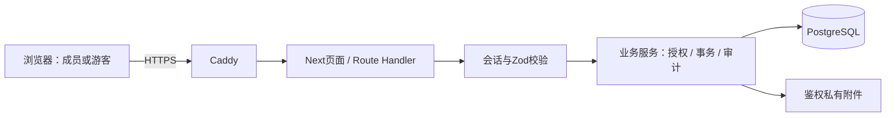

# 系统架构

Next.js App Router＋TypeScript/Tailwind，Better Auth学号登录，PostgreSQL 17＋Drizzle，Docker Compose＋Caddy。数据/API细节见[02](02-DATABASE.md)、[03](03-API.md)。

## 1. 请求链路

页面负责展示与交互；Route Handler解析身份和输入、调用服务、映射错误；服务负责规则和短事务；schema/连接在数据层。服务端页面可使用服务读取，客户端不直接访问数据库。

写入链路：会话确定操作者→Zod→服务端资源授权→版本/冲突校验→短事务写入与审计→明确成功或错误。外部网络和文件I/O不进入数据库事务。

## 2. 目录职责

| 目录或文件 | 职责 |
| --- | --- |
| `web/src/app`、`components` | 页面/API、课表、任务、消息、复用表单及居中确认 |
| `web/src/lib/server-auth.ts`、`auth.ts` | 当前会话成员及Better Auth |
| `course-*`、`schedule-*`、`availability-*` | 本人课程、周课表、时间冲突和空闲计算 |
| `registration-*`、`group-*` | 注册统计、小组权限及课表汇总 |
| `task-service.ts`、`task-schema.ts` | 任务状态、动态名单、成果、文件、消息及命令校验 |
| `work-*` | 本人工作记录、近期读取和成员任务摘要 |
| `web/src/db`、`drizzle` | 当前表定义、连接、不可修改的已执行迁移 |
| `web/test`、`src/lib/*.test.ts` | 数据库/浏览器验收、纯规则单元 |
| `web/scripts` | 初始化、备份恢复、文件校验及性能基线 |

以上`*-*`表示文件族，不要求新建对应目录。

## 3. 一致性与存储

- 课程写入锁定本人范围，同一短事务校验周次/冲突并审计；整表导入额外保存完整版本，单条CRUD不建版本。
- 任务和小组变更共用事务级advisory lock，管理用revision、成果用轮次及最新版本；结束名单固定，重开新轮。
- 文件先私有落盘，再短事务核验额度与元数据；清理先标记、事务外删除、最后释放额度。历史关联不删除。
- 消息删除按ID升序行锁，验证整批本人已读后删除；固定确认集合，缺失ID幂等，游标保持数值边界。
- 本人工作记录使用revision防覆盖；他人仅近期，完成时间不随普通文字编辑刷新。
- V3使用独立关系图/历史来源接口，服务端开关默认关闭；原成员近期读取不变，不沿用OCR凭据。AI接入及自动更新遵循下述模型契约，验证状态见07-TASKS。

## 4. 验证与运行

单元覆盖周次、冲突、时间和输入；集成覆盖会话/所有权/并发/分页；浏览器覆盖真实写入、手机交互和游客；恢复验证数据库与文件一致及真实HTTP访问。测试使用隔离库，证据在忽略的`web/test-results`。

生产使用持久卷，私有文件不进入public，PDF依赖从本机包白名单提供。备份、发布和回退见[04](04-DEPLOYMENT.md)；当前测试及上线状态只看[07](07-TASKS.md)。

## 5. V3隔离与失效契约

`graph-schema`定义严格范围，`graph-rules`只构建真实关系/布局及范围去重，`graph-service`负责身份复核、一致读取、独立历史来源和内容版本；`/graph`采用现有AppShell内的2D视图。服务端开关控制页面/API/导航，默认隐藏，游客不进入；不增加图形依赖、不写源业务。客户端搜索/状态筛选是显式子集，初始全量。

读取与模型分析分离：真实图不依赖模型成功。客户端定期取当前真实图及来源，失效或删除立即清空旧详情；切换范围取消旧请求，避免迟到结果覆盖新范围。源接口重新读库且不缓存。读取时间不是AI分析时间，未配置模型明确标注未启用。

生成式主题以输入版本和来源标识校验结果，不能信任模型提供的身份/来源。Node服务启动时由`instrumentation`注册后台观察循环，每15秒取当前版本，5秒合并静默窗口后认领分析；数据库租约保证多进程只处理一个版本，每个批次续租和重新核对版本。只在服务端两个V3开关同时开启且配置DeepSeek密钥时调用；失败退避，不能用浏览器轮询冒充无人访问时的自动分析。每次返回前确认来源仍在且版本一致，不向前台保留已删除原文。服务关闭/应用回退后图与历史来源不再可访问。

模型调用使用原生fetch和服务端Zod，不新增SDK。DeepSeek固定官方域名、`deepseek-flash`、非思考JSON输出；任务/工作全量分批处理，不默默截断历史。姓名和账号标识从正文替换，完整请求、响应和错误不写普通日志；结果用React文本渲染。

