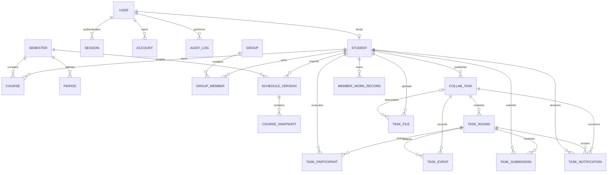

# 实体关系图

覆盖当前课表、任务、消息及工作记录；字段/索引以[schema.ts](../web/src/db/schema.ts)和[02-DATABASE.md](02-DATABASE.md)为准。v2.2不新增实体。

## 关键约束

| 范围 | 约束与删除边界 |
| --- | --- |
| 账号/成员 | 学号、绑定账号唯一；账号删除后成员绑定置空，不级联删除课程 |
| 学期/课程 | 单一当前学期，学期内节次唯一；成员/学期有课程时限制删除，周次为smallint数组 |
| 小组 | 组内成员唯一，最多一位leader；解散只级联成员关系，成员历史保留 |
| 导入版本 | 成员＋学期＋版本唯一，完整快照不可变；单条课程CRUD不建快照 |
| 任务 | 任务内轮次唯一，轮次内成员唯一，交付对象＋版本唯一；结束轮次保持历史 |
| 成果 | round＋author＋requestKey唯一；提交人/验收人引用成员，普通成员不能删除任务历史 |
| 文件 | UUID主键，上传人及关联任务外键限制删除；历史文件不能清理，deleting只能用于未关联文件 |
| 消息 | 引用任务/轮次及接收人；删除消息不反向删除任务、成果或文件 |
| 工作记录 | 仅本人写；状态/完成时间一致，revision为正；所有者外键限制删除 |
| 审计 | 操作者删除后置空；业务操作仅追加，元数据最小化 |

JSON目标数组、要求/成果附件ID及名称快照由服务校验与归档，不画成数据库外键。Better Auth的verification通过identifier识别校验目标，不伪画成user_id外键。新增外键必须同时评估查询索引。
