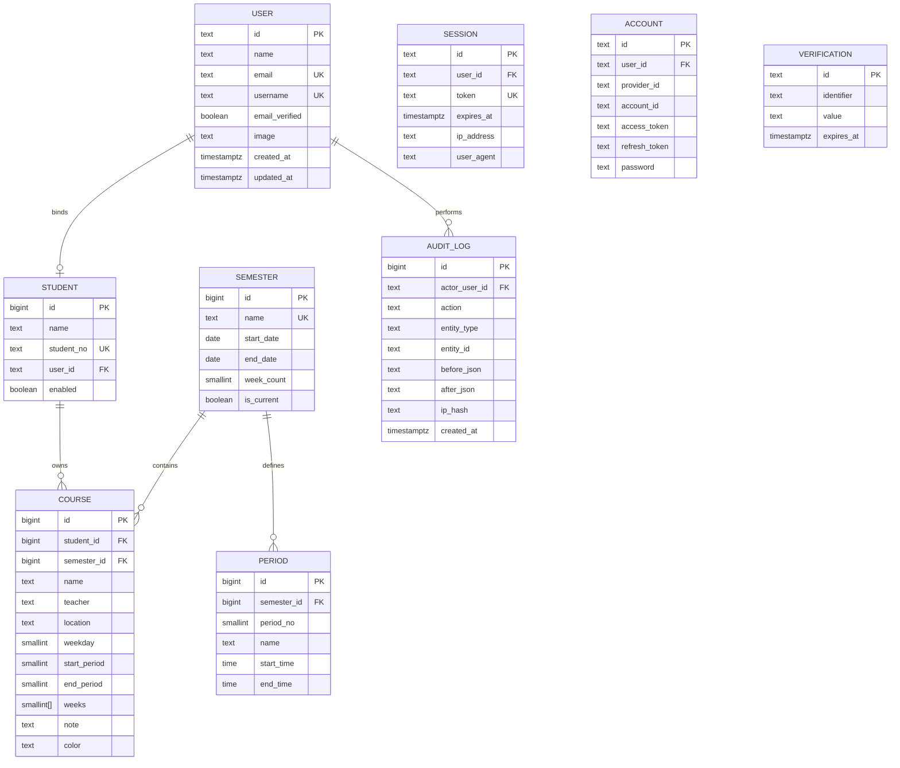
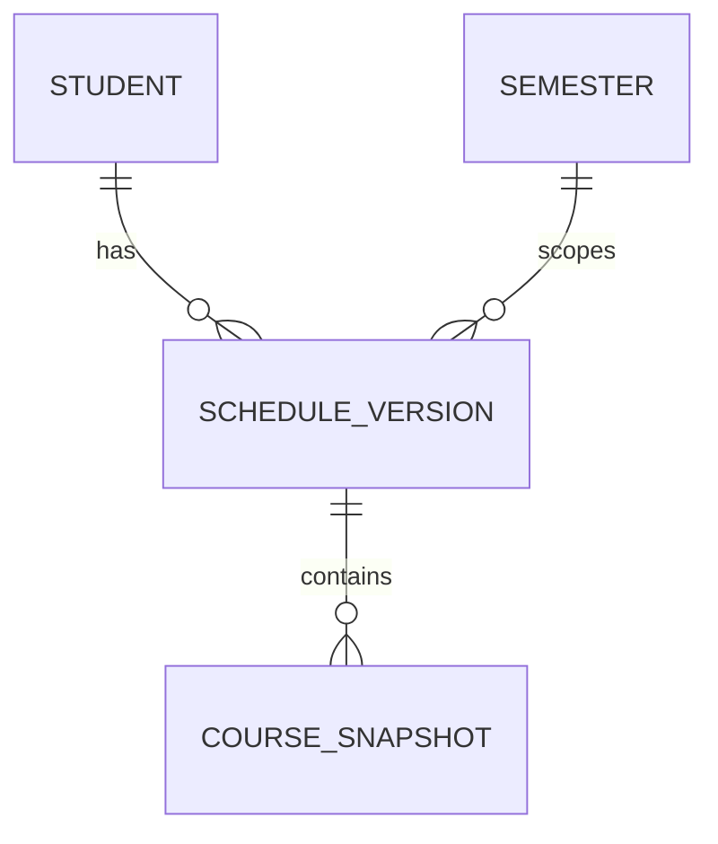

# 实体关系图（ER Diagram，MVP-A）

版本：1.0
状态：开发基线
日期：2026-09-27

本文与 [02-DATABASE.md](02-DATABASE.md) 配套，给出表、字段、主外键与关系的可视化。字段级权威定义以代码 [web/src/db/schema.ts](../web/src/db/schema.ts) 为准。

## 1. ER 图

## 2. 关系与删除策略

| 关系 | 基数 | 外键 | ON DELETE | 说明 |
| --- | --- | --- | --- | --- |
| user → student | 1 : 0..1 | `students.user_id` | `set null` | 一个账号最多绑一个成员；解绑后成员保留 |
| student → course | 1 : * | `courses.student_id` | `restrict` | 成员是课程所有者 |
| semester → period | 1 : * | `periods.semester_id` | `restrict` | 每学期一套节次 |
| semester → course | 1 : * | `courses.semester_id` | `restrict` | 课程归属学期 |
| user → audit_log | 1 : * | `audit_logs.actor_user_id` | `set null` | 操作者删除后审计保留 |
| student → group | * : * | `group_members.student_id` / `group_members.group_id` | `restrict` / `cascade` | 成员可加入多个组；解散组删除关系 |

认证四表（`session` / `account` / `verification`）由 Better Auth 管理，均以 `user_id` 关联 `user` 并 `on delete cascade`。

## 3. 关键约束与索引

| 表 | 约束 / 索引 | 含义 |
| --- | --- | --- |
| students | `student_no` 唯一 | 学号全局唯一（BR-02） |
| students | `user_id` 唯一（非空时） | 一个账号最多绑一个成员（BR-01） |
| semesters | `is_current = true` 部分唯一 | 同时最多一个当前学期 |
| semesters | `start_date <= end_date`、`week_count in 1..30` | 学期日期与周数合法 |
| periods | `(semester_id, period_no)` 唯一 | 学期内节次号唯一 |
| periods | `start_time < end_time`、`period_no in 1..20` | 节次时间合法 |
| courses | `weekday in 1..7` | 星期合法 |
| courses | `1 <= start_period <= end_period` | 节次区间合法 |
| courses | `cardinality(weeks) > 0` | 周数组非空（BR-04） |
| courses | `(student_id, semester_id)` 索引 | 读取个人课表 |
| courses | `(semester_id, weekday)` 索引 | 按日期/星期计算空闲 |
| courses | GIN `(weeks)` | 周次包含 / 相交查询（BR-05） |
| audit_logs | `(actor_user_id, created_at)`、`(entity_type, entity_id)` | 审计查询 |
| groups | `name` 唯一、`created_by_student_id` 索引 | 小组目录与创建来源 |
| group_members | `(group_id, student_id)` 唯一、`group_id` 组长部分唯一、两个外键索引 | 防重复成员、每组唯一组长、双向查询 |

## 4. MVP-B 预留（不进入当前阶段）

批量导入确认后生成完整快照，新增：

MVP-A 不创建 `schedule_versions` / `course_snapshots`，网页单条 CRUD 只写 `audit_logs`（BR-11）。
